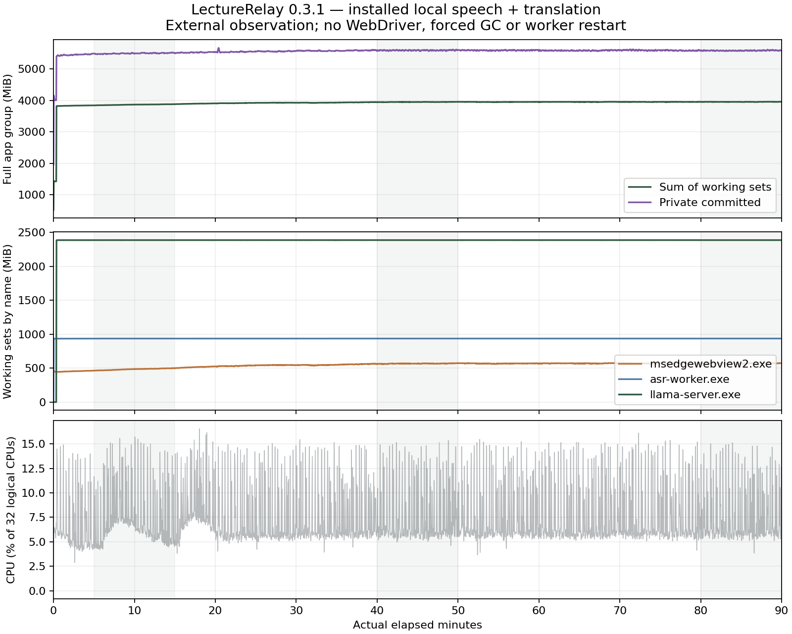

# Windows 0.3.1 reliability acceptance — 2026-10-03

**Status: COMPLETED WITH LIMITATIONS, not an overall classroom-quality pass.** Final installed short capture, GUI regressions, an independent real 90-minute run, replay/restart, local study workflows and controlled fault recovery completed. Recognition/meaning errors and audio-discontinuity attribution remain open. No elapsed time or result from 0.3.0 substitutes for the new run.

## Build and preservation

- Source commit: `832af9fe1fe3eecd3a8d6f660206ce38eff9d9c9` (local, not pushed).
- Final NSIS: `target/x86_64-pc-windows-msvc/release/bundle/nsis/LectureRelay_0.3.1_x64-setup.exe`, **16,147,354 bytes**.
- SHA-256: `75DC4DDEBCEE3A9EF2E7E682E67A685882272FF481C3021C7D3E44636C5F52E1`. Installed EXE SHA-256: `09734ED3E92814E59B8DE2CD489AEF938BB78ABE673A9EE863E4B37543CCDC54`. The unbundled build differs in exactly three bytes: Tauri's `__TAURI_BUNDLE_TYPE_VAR_UNK` → `__TAURI_BUNDLE_TYPE_VAR_NSS` installation marker; all other bytes match. The Start menu shortcut targets the stable installed EXE.
- Installed successfully through NSIS, exit 0, to `C:\Users\tianc\AppData\Local\Programs\LectureRelay`. Current-user uninstall registration reports 0.3.1 and this stable directory. This was an upgrade with WebView2 already present, not fresh-Windows/bootstrap testing. No signing or GitHub publication was performed.
- Same i9-13900KF / 32 logical CPU / approximately 64 GiB desktop as [0.3.0](installed-acceptance-v0.3.md). Local Nemotron, Hy-MT2 and Qwen only; no paid/authenticated cloud requests or credential-store inspection.
- Consistent SQLite backup plus complete library copy made with the app closed, before migration: `target/acceptance-v0.3.1/pre-migration`. Existing library/model files were also hashed; models were not duplicated.
- Read-only comparison preserved all original content: 5 courses, 25 lectures, 1,038 segments, manual notes, corrections, answers, marks, 536 translation versions and prior successful note versions. All original recording/model hashes match. Of 100 files, 98 are identical; the reviewed lecture's metadata/transcript snapshots were refreshed from the migrated DB. SQLite quick check is `ok`, foreign-key errors 0.
- Explicit comparison exceptions: proven local origin repair; proven import-source repair; the existing labelled classroom course restored from Trash for review. That course was active only during acceptance. Quiet Mode was switched off for the long review, then switched on for the final capture/resource baseline. Only one newly created disposable UI-test course was permanently deleted from the everyday library; all pre-existing courses are retained. Final preservation passed after the course was returned to Trash and every original preference value was restored. Quiet Mode is on and live translation is off, matching the pre-migration backup. The ordinary installed app is left on the portrait screen; test drivers are closed.

Schema 4 adds review checkpoints and cleanup commit markers, permits `origin=local`, and transactionally rebuilds transcript provenance constraints while preserving foreign-key dependants. Only `provider=local, origin=cloud` is repaired; manual/ambiguous origins remain unchanged. A recorded import task is required to repair historical import-source metadata. Historical files are not blindly rewritten.

## Findings and evidence

| Finding                                                       | Status                                     | Scope                                                                                                                                                                                                                                                                                   |
| ------------------------------------------------------------- | ------------------------------------------ | --------------------------------------------------------------------------------------------------------------------------------------------------------------------------------------------------------------------------------------------------------------------------------------- |
| Long review failed at first output limit                      | Fixed and verified                         | Actual saved 90-minute transcript completed through local Qwen in the installed first 0.3.1 candidate. Same generation path in final build.                                                                                                                                             |
| Progress lost on cancel/restart                               | Fixed and verified                         | Real cancellation, app restart, Resume reused the first saved section.                                                                                                                                                                                                                  |
| Limit recovery and final combination                          | Fixed and verified                         | One real combination output-limit recovery; persisted pairwise reduction completed. Controlled tests additionally cover section splitting and failed-combination resume.                                                                                                                |
| Mixed source versions / duplicate publication                 | Fixed and verified in focused tests        | Fingerprint changes for transcript, request, context, glossary, language and model; stale work cannot publish. Transactional publication is idempotent. Final build uses model SHA rather than a model-name literal in this fingerprint.                                                |
| Fractional segment defaults                                   | Fixed and verified                         | Native debug 7.95-second default and invalid bounds; final installed 4.54-second default saved unchanged and 0.001234–4.539877 edit retained. Rust covers very short audio and invalid/nonfinite bounds.                                                                                |
| Permanent course deletion and free storage                    | Fixed and verified within stated isolation | Isolated native debug/Rust full cleanup, rollback and recovery passed. Final installed Trash/restore, exact DELETE, wrong confirmation and cancel passed on a newly created disposable course. Production DELETE ALL button was enabled then cancelled; original files/models retained. |
| Wrong local provenance                                        | Fixed and verified                         | Migration preserves original content/history. Final installed short export contains 17 local/local rows; long capture saves 459 local/local bilingual rows. A later manual correction correctly becomes origin=manual.                                                                  |
| Failed import says recording failed                           | Fixed and verified                         | Historical and newly rejected media show Import failed in installed course/replay UI. Known invalid original file hash and existing lecture IDs are unchanged.                                                                                                                          |
| Toast covers Stop                                             | Fixed and verified                         | Actual start toast present with Stop visible and hit-testable at 1440 × 2490 portrait and 1180 × 780 landscape dimensions, both on the portrait display.                                                                                                                                |
| Explorer opens for every export                               | Fixed and verified                         | Two consecutive actual GUI exports left the same three Explorer window IDs; automatic open-folder calls removed, explicit Settings action retained.                                                                                                                                     |
| Technical terminology / split meaning                         | Still failing                              | Reproduced on original saved audio and glossary A/B; details below.                                                                                                                                                                                                                     |
| Review grounding                                              | Changed, still failing on some claims      | Source-only prompt removed observed biology-as-analogy interpretation, but unsupported elaboration and CUDA relations remain. Completion is not a factual-quality pass.                                                                                                                 |
| Stage-separated caption latency                               | Measured; no speedup claimed               | 16 joined native/DOM samples from final installed short capture; 100 ms polling and capture-anchor limitations below. Shipped ingress/model concurrency unchanged.                                                                                                                      |
| Independent 90-minute memory and replay                       | Completed; bounded result on this desktop  | 5,401.703 real seconds, no driver/injected polling. Mid/late working set 3,948.5/3,953.3 MiB; complete WAV read, source probes, five timestamp plays and restart passed. Native stop controller needed a second click; no stop latency claim from that attempt.                         |
| Audio discontinuities                                         | Still requires investigation               | Combined drop/discontinuity count 17 through the last sparse reading near minute 89, 186 at final save after delayed Stop. Signal probes passed, but the counter cannot identify missing samples or distinguish the two causes.                                                         |
| Installed local study and fault recovery                      | Verified within stated fixtures            | Real Hy-MT2/Qwen edit/translate, notes, review/cancel, Q&A and playable citations. ASR exit, translator exit, checkpoint failure and app exit preserve recoverable audio; restart preserves original and new content.                                                                   |
| Ordinary laptop resources / natural classroom quality / cloud | Not tested                                 | Desktop and short public speech cannot establish these.                                                                                                                                                                                                                                 |

Portable synthetic evidence: [review](../../experiments/local-ai/reports/2026-10-03-v031/review-completion.json), [destructive UI](../../experiments/local-ai/reports/2026-10-03-v031/destructive-ui.json), [data preservation](../../experiments/local-ai/reports/2026-10-03-v031/preservation.json). Raw data stays under `target/acceptance-v0.3.1`; screenshots under `target/installed-acceptance/screenshots/v031-*`. No databases, audio, credentials or heap dumps are committed.

## Actual long-transcript review

Reused lecture `453ce015-e9bb-4ee2-adcf-34975ce4d600`: **5,401.56 seconds, 460 segments**, the exact source that failed twice on 0.3.0. No replacement recording was made.

At **36.508 s**, cancel left **1/12 sections** persisted. After actual application restart, Resume reused that exact first result and finished in **814.854 s**. All **12/12 sections** are included, followed by a successfully generated overview; combine levels were **12 → 6 → 3 → 2 → 1**. A real output-limit finish during combination triggered the bounded concise retry and recovered. Exactly one new version was published; original segments, manual note and earlier versions compared equal.

Root cause was verbose output hitting a correctly rejected `length` finish, followed by in-memory-only progress. The fix keeps rejection of truncated output, requests concise evidence-based notes, splits a source section only on classified size limits (depth bound 3), and persists completed sections and every combine node. Pairwise reduction bounds combine input. Cancellation/errors preserve explicit partial work; startup never auto-runs inference. Final publication and checkpoint marking share a transaction.

Coverage means all source sections were processed and their generated notes retained. It does not prove every model claim is supported or every lecture fact was selected. For example, generated section notes still say kernels execute “in GPU shared memory”; one section adds an unsupported ordinary-least-squares comparison. These are semantic failures, not a successful grounding assessment.

## Deletion semantics

Settings → Data → Trash provides **Delete permanently**, requiring exact `DELETE`. A course must already be in Trash. **Free all storage…** requires exact `DELETE ALL` and removes all app-owned courses (including Trash), recordings, transcripts, notes/reviews, attached PDFs, in-app exports, downloaded models and task caches. Copied/exported originals elsewhere are not targeted.

Preferences, the installed app, Windows credentials and the small DB/browser profile remain; the confirmation states this. This feature frees class/model storage, not every byte used by the installed software. Recording, live AI, jobs, audio testing and downloads block cleanup. Frontend and backend both require confirmation. A staged-file journal coordinates filesystem removal with the DB transaction; startup completes committed cleanup or rolls back uncommitted moves. Path traversal/reparse points are refused. Locked-file, interrupted-journal, partial rollback and preservation fixtures passed.

## Recognition, meaning and latency experiment

Same pinned native worker, model and four-CPU Quiet affinity; four annotated synthetic clips plus a separately labelled short natural JFK public-speech excerpt. Compared 2-second versus 1-second audio ingress, with and without plausible pre-class terms including Moran's I, Getis-Ord Gi*, GeoAI, spatial heterogeneity, CRISPR-Cas9, CUDA and shared memory. These terms were passed through the existing worker glossary protocol. In these clips the glossary did not change the words; this does not prove that every engine/context configuration ignores glossary.

| Input/result                                     | 2 s ingress                                | 1 s ingress                                                                         |
| ------------------------------------------------ | ------------------------------------------ | ----------------------------------------------------------------------------------- |
| GIS terms, both glossary settings                | “Moran's eye”, “Get us or GI star”, “GOAI” | Same word errors                                                                    |
| Biology term                                     | “Crisp air canine”                         | Same error                                                                          |
| Ordinary statistical passage and JFK words       | Preserved, including negation              | Preserved, including negation                                                       |
| CS punctuation                                   | “…tokens kernel synchronization…”          | “…tokens. Kernel synchronization…”; missing punctuation after “performance” remains |
| Five-clip total inference wall time, no glossary | 28.960 s                                   | 28.511 s                                                                            |
| Peak worker working set                          | 935.25 MiB                                 | 935.18 MiB                                                                          |

This is a small accelerated worker comparison, not real-time full-app latency or laptop power measurement; differences are not a statistical speedup claim. Timed final baseline was rerun after the build/load-heavy first exploratory run. [Raw A/B outputs](../../experiments/local-ai/reports/2026-10-03-v031/speech-2s-False.json) and [1-second outputs](../../experiments/local-ai/reports/2026-10-03-v031/speech-1s-False.json) retain CPU time, segmentation, partials and text.

Also cropped **3534–3574 seconds from the original saved WAV**, without altering it. At 2-second ingress, the 20-second forced endpoint split “but spatial.” from **“Homogeneity remains important.”** At 1-second ingress, an earlier silence endpoint split at 15 seconds and the next unit correctly retained **“spatial heterogeneity remains important.”** CUDA still lost its intended sentence relation in both. See [2 s original-audio reproduction](../../experiments/local-ai/reports/2026-10-03-v031/saved-boundary-2s-False.json) and [1 s comparison](../../experiments/local-ai/reports/2026-10-03-v031/saved-boundary-1s-False.json).

This identifies endpoint alignment as a contributor, separate from model terminology errors. One-second ingress is promising but **not adopted** without full-app translated-unit/CPU testing; product ingress remains 2 seconds. No hardcoded transcript replacement or translation-based correction was introduced. Prior [correct-input translation fixtures](../../experiments/local-ai/reports/2026-10-03/languages.json) distinguish translation from ASR errors, but were not rerun in this final-build round. The installed capture and study flow exercised Hy-MT2 Chinese again; Japanese/Korean quality remains unvalidated for this build. The JFK excerpt is natural speech, not an annotated classroom-quality benchmark.

Opt-in `LECTURERELAY_TRACE_CAPTIONS=1` logs only timestamps/segment IDs for speech start/final, translation queued/start/done/publication. The final installed `reliability-short.mjs` run captured approximately three minutes through real Windows system audio, with Quiet Mode on, Nemotron and Hy-MT2. It saved 17/17 bilingual local segments, passed pause/resume and scroll/Jump to Live, and played the saved timestamp. Capture stopped in 38 ms; translation drain was awaited separately. The toast was present while Stop was visible and hit-testable in the 1440 × 2490 portrait viewport. A separate actual installed capture passed the same test at 1180 × 780 landscape dimensions on the portrait display.

Stage timings join 16 segments observed in the DOM with their native trace; the final saved segment after Stop was not a DOM-latency sample. The capture anchor is estimated from the frame clock. DOM polling is 100 ms plus driver round-trip, and capture-status quantization adds uncertainty. These are small-sample measurements; nearest-rank p95 equals the maximum for 16 samples.

| Stage                                         |     Median | p95 / maximum |
| --------------------------------------------- | ---------: | ------------: |
| Audio unit duration                           |    9.000 s |      20.000 s |
| Audio end → final speech call start           |    0.482 s |       0.977 s |
| Final speech call                             |    0.691 s |       0.728 s |
| Translation queue wait                        | 0.000353 s |    0.000530 s |
| Translation inference (includes cold loading) |    1.007 s |       5.157 s |
| Save/publication                              | 0.003157 s |    0.004901 s |
| Publication → observed translated DOM         |   0.0777 s |      0.1122 s |
| Audio unit end → translated DOM               |    2.308 s |       5.861 s |
| Audio unit start → translated DOM             |   12.284 s |      23.450 s |

The final speech call excludes earlier streaming partial-inference work. Audio accumulation remains a substantial part of start-to-translated-text delay. Earlier 0.3.0 measurements used up to five-second DOM polling and a different observation method; these numbers are **not a demonstrated product speedup**. The shipped two-second ingress and model concurrency are unchanged. See local `stage-short.json`, `stage-analysis.json` and the timestamp-only native trace.

## Independent installed 90-minute run

The ordinary installed EXE was launched without WebDriver and without caption trace mode. The external observer ran **5,401.703 seconds** with actual Windows playback/loopback and local Nemotron + Hy-MT2, Quiet Mode on. It sampled the full descendant process tree and saved-row counts read-only every two seconds (**2,677 samples**). Sparse native UI checks confirmed ongoing captions and accessible controls. No injected JavaScript/native IPC polling, forced collection, app reset or worker restart was used. Each inference worker had one PID throughout.

| Window                        | Working-set sum median | Private committed median |
| ----------------------------- | ---------------------: | -----------------------: |
| Loading / first 0–2 minutes   |            3,824.7 MiB |              5,427.7 MiB |
| Early 5–15 minutes            |            3,865.7 MiB |              5,492.6 MiB |
| Middle 40–50 minutes          |            3,948.5 MiB |              5,593.6 MiB |
| Late 80–90 minutes            |            3,953.3 MiB |              5,584.1 MiB |
| Peaks over the run            |            3,957.7 MiB |              5,665.8 MiB |
| 60 seconds after saved status |              582.3 MiB |                501.2 MiB |

Late working-set contributors: Hy-MT2 server **2,386.3 MiB**, ASR **936.2 MiB**, WebView2 processes **570.9 MiB**, application **43.8 MiB**, console hosts **16.1 MiB**. ASR's private committed memory is about 3,711.5 MiB despite its smaller resident working set. Summed working sets may double-count shared pages; private commitment is not physical resident use. Average CPU was **7.32% of 32 logical CPUs**, p95 **14.14%**.

Most observed growth occurred as the caption history filled. Middle-to-late working set increased **4.8 MiB**; last-30-minute linear slopes were **+0.059 MiB/min** working set and **−0.094 MiB/min** private commitment. This run supports a plateau under this workload, not proof of absence of every leak. It also does not show that approximately 3.86 GiB resident / 5.45 GiB private commitment is suitable for an ordinary student laptop.

The largest observed saved-English-minus-translated-row difference was **2**. Sparse existing performance-file readings from minute 31 onward showed no backlog; these are not continuous native queue telemetry. At observer completion 458/458 rows were saved; finalization produced **459/459 local bilingual rows**.

The first native Stop click did not produce a confirmed stop; a second coordinate click succeeded. The saved WAV is therefore **5,477.26 seconds**, including about 76 seconds after source playback ended. This is a controller/interaction observation, not a proven backend cause and not a stop-response benchmark. All inference processes were already gone by the first post-save sample (0.859 seconds after detected saved status); idle memory was sampled without GC or reset. The transient post-stop translation message was not captured reliably in this attempt. The separate short UI recorder-stop measurement was 38 ms.

The audio warning remains significant: the combined dropped/discontinuous count was **17** at sparse readings through about minute 89 and **186** in the final native report. Later events were not sampled individually. The code merges queue-send failures with CPAL/WASAPI discontinuities, so these counts do not establish the number or duration of lost samples. Do not call this zero-dropout recording or dismiss the warning as startup-only.

Every declared WAV frame was readable: **262,908,480 frames at 48 kHz**. Across the played 90 minutes, **234** known source-envelope probes passed; minimum correlation **0.9395**, maximum alignment drift **0.16 s**, and last ten played seconds correlation **0.9399**. The known silent tail is excluded only from source correlation, not from complete-file reading. After ordinary restart, actual playback passed at **0, 1,348, 2,704, 4,040 and 5,396 seconds**. Later controlled crash/restart again preserved the long recording's metadata and all segments. These checks are not a claim that a person listened continuously to the entire recording.

The new run also reproduced **two** standalone “Homogeneity remains important” segments, plus technical-name and CUDA-relation errors. Long-run continuity does not make those captions accurate. [Selected source/translation failures](../../experiments/local-ai/reports/2026-10-03-v031/new-run-quality-examples.json).

Evidence: [external summary](../../experiments/local-ai/reports/2026-10-03-v031/independent-result.json), [trend analysis](../../experiments/local-ai/reports/2026-10-03-v031/independent-analysis.json), [WAV verification](../../experiments/local-ai/reports/2026-10-03-v031/independent-wave.json), [post-stop samples](../../experiments/local-ai/reports/2026-10-03-v031/independent-post-stop.json), [replay](../../experiments/local-ai/reports/2026-10-03-v031/independent-replay.json). Raw process samples stay local.

## Installed study and failure checks

On the new three-minute fixture, actual Hy-MT2 regenerated an edited segment, search found that edit, manual draft/save and bookmark/chapter creation persisted. With Quiet Mode off for post-class work, Qwen summary took **29.165 seconds**, cancellation returned in **3.452 seconds**, a subsequent requested review saved a separate version, and Q&A returned a correct association-versus-causation answer citing relevant source snapshots. Citation clicks played the recording. Manual notes remained identical. Generated notes still repeated the incorrect CUDA relationship and uncertain technical names; this is a workflow pass, not a blanket quality pass. Quiet Mode was restored before the fault tests.

| Controlled failure                          | Actual installed result                                                                                                    |
| ------------------------------------------- | -------------------------------------------------------------------------------------------------------------------------- |
| ASR process exit                            | Recording continued; 18.32-second saved WAV played.                                                                        |
| Translator process exit                     | English/audio retained, one translation explicitly deferred for retry; 16.27-second WAV played.                            |
| Test lecture checkpoint destination blocked | Clear checkpoint-write error; earlier 10.15-second WAV retained and playable. Destination restored immediately.            |
| Unexpected app exit                         | Restart visibly reported one recovered lecture; 9.13 seconds before exit and 9.13 seconds recovered, with actual playback. |

After restart, manual notes, both new AI versions, marks/drafts, the new long transcript and the previously completed 90-minute review compared equal. A fresh invalid media import showed “Import failed” and preserved its source hash and existing lecture IDs. Two consecutive GUI exports retained exactly the same three Explorer window IDs. Only the newly created disposable course was permanently removed; full destructive storage cleanup remained confined to the isolated fixture.

Evidence: [study checks](../../experiments/local-ai/reports/2026-10-03-v031/study-checks.json), [faults and restart](../../experiments/local-ai/reports/2026-10-03-v031/faults-completed.json), [import](../../experiments/local-ai/reports/2026-10-03-v031/import-result.json), [export windows](../../experiments/local-ai/reports/2026-10-03-v031/export-windows.json), [final preservation](../../experiments/local-ai/reports/2026-10-03-v031/preservation.json).

## Checks and open limits

Passed: `pnpm check:web`, release web build, `pnpm test:rust` (**41 desktop + 1 environment test; 11 hardware/model fixtures ignored**), `pnpm lint:rust`, `pnpm format:check`, `pnpm format:rust:check`, `pnpm verify:repo`, `pnpm verify:resources`, `pnpm release`. Repository pattern scan found zero candidates; this is not an independent security audit. Git/process-spawn sandbox denials were resolved by an approved command rerun, not by bypassing a failed product test.

The tested product source and installer did not change during the resumed acceptance; this continuation adds test controllers, evidence and documentation. Changed JavaScript/Python controllers passed syntax checks. Final `pnpm format:check` and `pnpm verify:repo` passed; the latter checked 347 source files and reported zero potential secrets or repository issues. This pattern scan remains a hygiene check, not an independent security audit.

Remaining failures/limits: technical recognition and some sentence meanings; unsupported study elaboration on the earlier long review; combined audio-event attribution and the unconfirmed first native Stop click. Fresh Windows/WebView2 bootstrap, authenticated cloud failure paths, physical device disconnect, real disk-full/power-loss scenarios, independent security review, expert CJK accuracy assessment and representative laptop power/fan/memory acceptance remain untested. Source recognition/grounding must improve before claiming classroom-quality acceptance.
