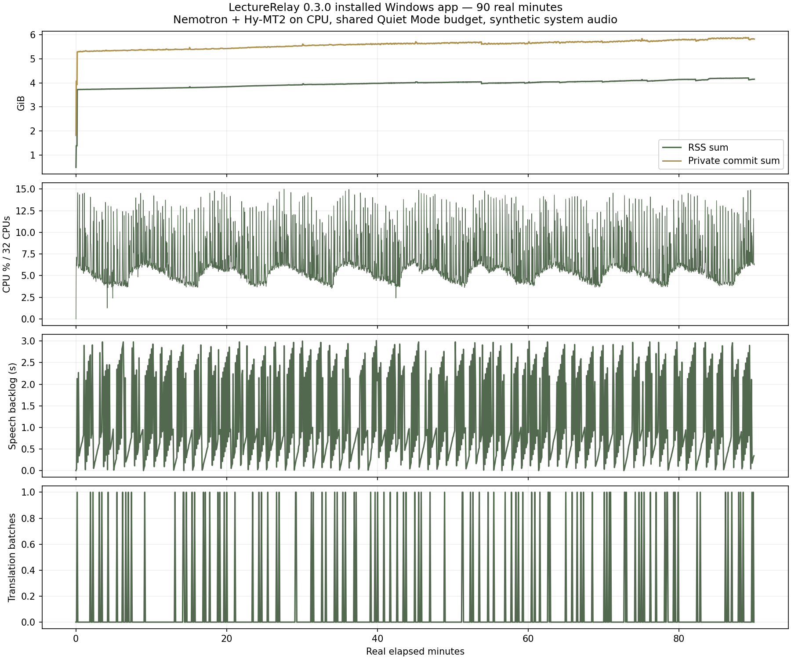

# Installed Windows acceptance — 2026-10-03

Status: testing completed with failures. The installed 90-minute capture/replay, controlled recovery and normal regression checks passed. Full-length review failed twice, and the segment editor has an invalid-default validation defect. This is not an overall release pass.

## Build and scope

The test starts from the published **0.3.0 NSIS installer**, not `pnpm dev` or the debug fixture build. Source baseline: `24d9a246c35e268a3698f36f72aa4c6281e567a2`.

- Installer: `LectureRelay_0.3.0_x64-setup.exe`, 16,069,194 bytes; SHA-256 `E870496B2035F138BC77FDEA772BBF87FD69F09A7551A8F28CAE2DF6F96A7C58`.
- Interactive welcome, existing-installation/reinstall, destination, installation-complete and finish pages were exercised. This is an **upgrade/reinstall on a machine with WebView2**, not a fresh Windows installation or a test of WebView2 bootstrap downloading.
- Installed directory: `target/acceptance-v0.3-2026-10-03/app`. Runtime/resource verification passed; the installed icon and release payload check passed. NSIS changes the executable's bundle-type marker, so its whole-file hash differs from the unbundled release executable.
- Machine: Intel i9-13900KF, 32 logical CPUs, approximately 64 GiB RAM. CPU inference; no GPU inference. Results do not establish ordinary-laptop power, fan noise or latency.
- No paid/authenticated cloud requests. Speech: Nemotron Streaming EN 0.6B. Translation: Hy-MT2-1.8B Q4_K_M. Study: Qwen3.5-4B Q4_K_M. Shared Quiet Mode enabled for inference.
- The production EXE uses Windows Known Folders. Before testing, the actual library was inspected and contained only the older labelled acceptance course and 13 synthetic lectures. SQLite and settings were backed up. This run uses a new `[ACCEPTANCE 2026-10-03] Local AI classroom` course; it does not claim a separate Windows user profile.
- Native interaction took place on the left portrait display. The native app frame was moved and maximized through Computer Use. **Do not use Edge WebDriver `window/rect` or `window/maximize` to position this Tauri app:** in this environment they reposition the embedded WebView and can leave the native frame blank. That controller error was cleared by restarting; it is not a passing UI result or a reproduced product defect.

Raw local evidence is under `target/acceptance-v0.3-2026-10-03`; screenshots use the `v03-` prefix under `target/installed-acceptance/screenshots`. Recordings and test classroom data remain in the app's normal synthetic acceptance library.

Selected synthetic, portable evidence is retained in [the October 3 evidence directory](../../experiments/local-ai/reports/2026-10-03): [soak metrics](../../experiments/local-ai/reports/2026-10-03/soak-summary.json), [audio verification](../../experiments/local-ai/reports/2026-10-03/wave-summary.json), [controlled recovery](../../experiments/local-ai/reports/2026-10-03/faults-completed.json), [six translations](../../experiments/local-ai/reports/2026-10-03/languages.json), [review failure](../../experiments/local-ai/reports/2026-10-03/long-review-failure.json) and [original-data preservation](../../experiments/local-ai/reports/2026-10-03/baseline-preservation.json). Databases, audio, raw heap snapshots and driver wrappers are excluded.

## Completed short flow

| Area         | Observed result                                                                                                                                                                                                                                                                |
| ------------ | ------------------------------------------------------------------------------------------------------------------------------------------------------------------------------------------------------------------------------------------------------------------------------ |
| Setup        | Created course, background and three glossary terms through the installed UI. Existing Nemotron download was recognized. Downloaded Hy-MT2 and Qwen through Settings. Cancelled Qwen after data arrived, verified not installed/zero downloaded, then downloaded successfully. |
| Preferences  | Light/dark and Quiet Mode on/off persisted. Local translation and study selected independently from disconnected cloud provider.                                                                                                                                               |
| Devices      | Five-second microphone and system-output checks both detected audio. This does not prove microphone recognition quality or unplug recovery.                                                                                                                                    |
| Capture      | 181.92 seconds of real wall time, 178.66 seconds saved after a pause. Real WASAPI output capture and real local inference.                                                                                                                                                     |
| Captions     | 15 finalized English segments and 15 saved Chinese translations. History scrolling, Jump to Live, pause and resume passed.                                                                                                                                                     |
| First result | English approximately 4.09 seconds and Chinese approximately 14.21 seconds after playback launch; includes loading, segmentation and up to 2 seconds of polling.                                                                                                               |
| Queue        | Maximum observed translation queue 1 batch; maximum speech backlog 2.85 seconds.                                                                                                                                                                                               |
| Stop / audio | Native recorder cleared in approximately 40 ms; live processing drained in 3.16 seconds. The short-run banner sample was taken before React navigation completed and does **not** verify the post-stop banner. The long-run controller waits for the replay view.              |
| Replay       | Five timestamp positions played without media errors. Every declared WAV frame was readable; this is not continuous human listening or acoustic verification of every sample.                                                                                                  |
| Edit / study | Edited source, cleared a translation and regenerated it using real Hy-MT2. Search, manual notes/draft, bookmark and chapter passed.                                                                                                                                            |
| Summary      | Real Qwen summary took 83.4 seconds under Quiet Mode; saved as a separate version and preserved manual notes.                                                                                                                                                                  |
| Review / Q&A | Review cancellation returned in 2.35 seconds. A subsequent requested full-class review saved a new version. Q&A saved source snapshots; clicking a source played the corresponding audio.                                                                                      |
| Export       | All nine UI export choices produced files. Checked bilingual subtitle structure, JSON segment count and preservation of manual notes.                                                                                                                                          |
| Persistence  | Moved only the new course to Trash, restored it, restarted the installed app and compared segments, notes, versions, marks and answers. All matched.                                                                                                                           |
| Key form     | Synthetic four-character invalid input was rejected locally, cleared from the password field and not saved. No real credential or provider request was used.                                                                                                                   |

Two discontinuity notifications occurred at start/resume. They did not increase continuously. Whole-timeline source correlation is reserved for the uninterrupted 90-minute run; a readable short WAV alone does not settle whether a discontinuity was audible.

## Content quality observations

Functional checks do not certify translation or summary accuracy. The known synthetic source says “Moran's I”, “Getis Ord G I star”, “Geo A I” and “CRISPR Cas nine”; real transcription produced variants including “Moran's eye”, “Get us / GI star”, “GOAI” and “Crispr air canine”. Translation and summaries propagated some of these errors. The course glossary did not contain these particular terms.

Qwen retained the statistical-association/causation distinction and produced the requested practice questions in the review. It also used background topics in its heading and made an unsupported interpretation that the biology material was an analogy/background. Its own “all facts from evidence” closing sentence is generated text, not verification. No claim of classroom accuracy or best default follows from this synthetic flow.

The 60-minute screenshot also shows the known source's “spatial heterogeneity remains important” split across final segments. At 59:14, the resulting source is **“Homogeneity remains important.”** and the Chinese is **“均匀性仍然重要。”** This changes the concept, rather than just spelling a name differently. At 59:18, missing punctuation causes “CUDA kernels execute on the graphics processor shared memory…” to be translated as executing in GPU shared memory. Translation-only checks with manually entered source text are tracked separately so these upstream transcription/finalization failures are not attributed solely to Hy-MT2.

The stored live segments also retain `origin: "cloud"` while correctly reporting `provider: "local"`. This is reproducible legacy metadata in `speech/streaming.rs`, not evidence of a cloud request. It needs consistent provenance naming, particularly in JSON exports.

## Real 90-minute local capture

The real local speech-plus-translation run started at **2026-10-03 05:32:35 UTC** and ran for **5,401.08 real seconds**. Source WAV was a continuous sequence of four non-sensitive synthetic clips, played through Windows output and captured through WASAPI. It was not injected into the speech worker. The controller recorded the whole app descendant process group every 2 seconds, with UI/native status every 5 seconds and a single screenshot per 15-minute milestone.

| Measurement                           | Observed result                                                                                                                                                                  |
| ------------------------------------- | -------------------------------------------------------------------------------------------------------------------------------------------------------------------------------- |
| Saved audio                           | 5,401.56 seconds, 48 kHz mono WAV, all 259,274,880 declared frames readable                                                                                                      |
| Saved text                            | 460 finalized English segments and 460 Chinese translations                                                                                                                      |
| Queue / backlog                       | Maximum one translation batch, zero deferred translations; maximum speech backlog 3.01 seconds                                                                                   |
| First visible output                  | English 5.06 seconds; Chinese 15.10 seconds after starting source playback                                                                                                       |
| Source chunk end → English DOM        | Median 1.93 seconds, p95 5.65 seconds                                                                                                                                            |
| Source segment end → translated DOM   | Median 5.12 seconds, p95 7.87 seconds                                                                                                                                            |
| Source segment start → translated DOM | Median 15.73 seconds, p95 27.84 seconds, maximum 29.67 seconds                                                                                                                   |
| Stop                                  | Recorder cleared in 46.6 ms; replay view in 360 ms; remaining processing finished in 2.28 seconds                                                                                |
| Stop feedback                         | Actual replay view displayed “Recording saved” and “Remaining captions are processing. You can play the saved audio now.”                                                        |
| Replay                                | Played five positions across transcript pagination, including approximately 89:14, without media errors                                                                          |
| Source matching                       | 234 timeline probes; minimum 100 Hz RMS-envelope correlation 0.999950; final ten seconds 0.999974; no drift detected at 10 ms resolution                                         |
| CPU                                   | Whole process group mean 6.69%, p95 12.89%, peak 14.99%, normalized over 32 logical CPUs                                                                                         |
| Memory under original instrumentation | RSS sum median 4,088 MiB, peak 4,301 MiB; early 1–5 minute median 3,825 MiB, final ten-minute median 4,279 MiB. Private commit peak 6,020 MiB. See instrumentation caveat below. |

The DOM latency proxy includes up to five seconds of polling and recorder-clock quantization; it is not an acoustic word-boundary measurement. Measuring from the segment's start includes the time spent accumulating/finalizing that segment. This matters for perceived live translation: a stable queue does not mean instant translated captions. Last-segment translation completed after stopping, so 459 translated-DOM events precede the final stored total of 460.

One audio discontinuity was reported at startup and did not increase during the uninterrupted run. File readability and source-envelope checks passed, including the beginning and tail. The warning alone does not establish an audible dropout; these checks also do not claim a human listened continuously to every sample.

### Memory instrumentation finding

Both inference processes exited after normal drain. Idle app-group RSS was approximately 980 MiB. A post-run diagnostic garbage collection reduced it to 897 MiB, while JavaScript still retained approximately 246 MiB. No forced collection occurred during the baseline.

A heap snapshot then identified **2,218 EdgeDriver native-read timer chains** (1,085 `live_status`, 1,081 `recording_status`, and 52 other reads). The observed chain is `DOMTimer → ScheduledAction → V8Function → closure/context → resolved Promise → read result`; its plain-result object graph accounts for at least 83.4 MiB of self-size, excluding other driver/engine overhead. This is not a formal dominator retained-size calculation.

The injected callback wrapper was passed `30,000,000` ms and kept resolved results reachable until that timer expired. This mechanism matches the [Chromium callback-wrapper source](https://chromium.googlesource.com/chromium/src.git/+/lkgr/chrome/test/chromedriver/js/execute_async_script.js). The test helper now uses W3C `execute/sync` with a returned Promise instead of callback-style `execute/async`; its real native reads were checked successfully. Original measurements are retained, not silently replaced or “corrected.” The 90-minute memory growth cannot be attributed wholly to LectureRelay from this instrumented run, and finding driver retention does not independently prove absence of every application leak.

### Independent ten-minute comparison

The WebDriver session was closed, and the same installed EXE was launched normally. All app actions used native UI on the portrait display. A separate observer played the same synthetic source and sampled process counters/read-only SQLite for **601.13 seconds**, with no WebDriver, CDP, injected JavaScript or native IPC reads. There was no diagnostic garbage collection.

App-group RSS median rose from **3,829 MiB** in minutes 1–3 to **3,856 MiB** in minutes 8–10; WebView2's corresponding sum rose from **455 to 480 MiB**. Peak app-group RSS was 3,861 MiB and mean CPU 6.70% of 32 logical CPUs. This is much less growth than the instrumented ninety-minute result, but the durations differ and the shorter transcript adds DOM content: it is not proof that every leak is absent or a corrected ninety-minute benchmark.

After the observer ended, native Stop & save produced **634.45 seconds** of audio and 51 English/Chinese segments. The longer saved duration includes setup and the interval before native stop. Every declared WAV frame was read, clicking 00:08 visibly played past 00:10, and both inference workers exited. App-group RSS after stopping was 561 MiB. [Observer measurements](../../experiments/local-ai/reports/2026-10-03/standalone-result.json) and [saved-result checks](../../experiments/local-ai/reports/2026-10-03/standalone-final.json) are separate from the ninety-minute baseline.

## Full-length review failure

The same saved 90-minute transcript was submitted to Qwen for whole-class review with Quiet Mode off. It planned 13 progress steps (12 source sections plus combination), but failed after the first section on **two attempts**, in approximately 217 and 215 seconds. The second attempt captured the actual error: **“Local AI reached its output limit. Split the input and retry; incomplete output was not saved.”** No new review version was saved. The original recording and 460 English/Chinese segments remained unchanged.

The per-section local notes call currently requests 1,536 output tokens, and the provider rejects non-`stop` finishes. Whole-class review has already split the transcript internally, so telling the user to split it again is not a usable recovery for this workflow. Completed section drafts are held in memory until the entire job finishes; this failed job has no persisted section draft to resume. This is an actual release-blocking limitation for the advertised full-class review path, not a controller timeout or simulated provider failure. Short summary/review success does not cover it.

## Controlled failures and resource policy

During actual simultaneous inference, both speech and text workers were observed on CPU affinity `[0,1,2,3]`. The text server listened only on `127.0.0.1`; an unauthenticated `/v1/models` request returned 401. The audit did not read the runtime key or process environment/command line.

Fault tests were scoped to this new test course and its installed executable. All four completed:

| Fault                             | Observed recovery                                                                                                                                                                      |
| --------------------------------- | -------------------------------------------------------------------------------------------------------------------------------------------------------------------------------------- |
| Speech worker terminated          | Capture continued; saved 18.62 seconds and played successfully.                                                                                                                        |
| Translation worker terminated     | English and 15.75 seconds of audio remained; one deferred translation and an explicit retry message appeared.                                                                          |
| Recovery checkpoint write failure | Only a test lecture's checkpoint destination was made unwritable. Capture reported the failure; the earlier 10.12 seconds remained readable/playable. The temporary fault was removed. |
| App terminated while recording    | Before exit: 9.16 seconds. Restart recovered 9.11 seconds with interrupted status and successful playback. All terminated app descendants exited.                                      |

Every declared audio frame in all four fault recordings was readable. The short lecture's notes, AI versions, answers and marks, plus all 460 English/Chinese segments of the long lecture, survived the crash/restart. This proves these controlled recovery paths, not zero-loss guarantees for all failures.

Physical unplug, a truly full disk, authenticated provider failures, a separate low-power laptop and an independent security audit are outside the completed evidence.

## Additional UI defects

- **Invalid default segment time:** on a 7.95-second recording, Add Segment prefilled end time `7.95`, while the numeric input requires `step="0.1"`. Browser validation blocked Save Transcript. Entering `1` manually allowed the functional translation fixture to proceed. The failed default and workaround are recorded separately; the default flow is not a pass.
- **Transient toast overlaps Stop:** the recording-start toast covered the bottom Stop & save button on the portrait layout. An early automated click was intercepted, leaving an audio-only fixture recording until the controller stopped it. The harness now waits for the toast to disappear. This is not a spontaneous recorder stop or data loss; stop-control accessibility during notifications should improve.
- Each export opens another Explorer window. All files were produced, but repeated exports accumulate windows.
- Damaged media is rejected explicitly and leaves a failed zero-duration record with “Needs attention” in the library. The course page labels it “Recording did not start”, which should identify import failure instead. The first immediate controller read preceded the failure-row update; restart confirmed the final failed record. Existing recordings and the source file were preserved.

## Translation, media and regression checks

Six actual installed model requests covered Hy-MT2 and Qwen, each translating one fixed English paragraph to Chinese, Japanese and Korean. All six saved non-empty output in the requested script, retained `120`, `12`, `5%` and `2%`, and preserved the tested causality/negation distinction on inspection. Hy-MT2 took 5.96–7.88 seconds and Qwen 14.66–16.21 seconds including per-job loading, under Quiet Mode. These are six smoke requests without concurrent speech, not a quality ranking. Correctly supplied `CRISPR-Cas9` remained recognizable in all six translations, helping distinguish speech errors from translation-only behavior. Japanese/Korean terminology still needs fluent subject-matter review.

Native file pickers imported a 119.77-second synthetic WAV and a two-page local PDF. The original WAV SHA-256 was unchanged; imported audio actually played. PDF page 1 and page 2 rendered, and switching to 125% increased the canvas dimensions. A separately created invalid WAV was rejected with “This media format is unsupported or damaged.” Only WAV and this PDF fixture were exercised through the installed GUI; this does not certify every listed media codec or arbitrary PDFs.

Normal checks passed: frontend type checking and production build, Rust workspace tests (31 desktop + 1 environment test), Clippy with warnings denied, whole-repository Prettier checking, Rust formatting and repository verification. Nine opt-in desktop tests and the native hardware test are ignored by the normal test suite; the actual installed tests above are separate evidence. The dedicated Credential Manager roundtrip was explicitly invoked and passed, saving/replacing/removing only a synthetic unique test target. The provider error test exercised synthetic 401/403/429/503 and malformed success responses through local TCP and verified canary redaction. None of this is authenticated cloud acceptance.

The read-only baseline comparison found zero missing/changed original rows: one course, 13 lectures, 503 transcript segments, one glossary term and two prior edits. SQLite `quick_check` returned `ok`. Added acceptance rows are intentional and retained.

At completion, all original preference values were restored through the installed UI and compared with the pre-test backup: light theme, Quiet Mode on, microphone default, local English speech, cloud disconnected and live translation off. Downloaded models and labelled test courses remain available. No recording remains active, and the dedicated test driver was closed. Application source and the published EXE were not modified during this testing turn; changes are test tooling, evidence and documentation.

## Release assessment and next fixes

This run supports the recording, local inference wiring, storage and controlled recovery paths on this desktop. It is **not an overall release pass**. Priorities before claiming full-class readiness:

1. Make whole-class review handle output limits automatically and persist resumable section drafts. Retest the same complete 90-minute transcript, including preservation of manual notes and cancellation/restart.
2. Fix the segment editor's invalid default times; cover editing existing fractional timestamps as well as adding short segments.
3. Evaluate speech finalization, terminology and translation delay using natural classroom recordings and language-specific review. Stable queues and model self-reports do not establish semantic correctness.
4. Correct local segment provenance, import-failure wording and notification placement over recording controls.
5. Repeat full-duration memory observation without callback-driver retention, then test a representative student laptop. The separate ten-minute observation cannot establish ninety-minute memory stability.

Uncovered: fresh Windows/WebView2 installation, physical device disconnection, actual network loss, a genuinely full disk, all media formats, ordinary-laptop power/fan noise, authenticated cloud services and an independent security audit. Paid cloud testing remains excluded by the user's instruction.

## Reproduction

Use [installed GUI test setup](../../tests/e2e/README.md), then `installed-local-live.mjs short`, `installed-local-study.mjs` and `installed-local-live.mjs soak`. Position the **native outer frame** on the portrait monitor first; never use WebDriver window movement here. The new scripts target the exact new acceptance course and require cloud provider `none`.

After capture, use `verify-wav.py`, `analyse-local-soak.py`, `local-runtime-audit.py` and `installed-local-faults.mjs` as documented by their CLI arguments. A failed controller, incomplete long run or pending restart check must not be counted as a passed acceptance.
